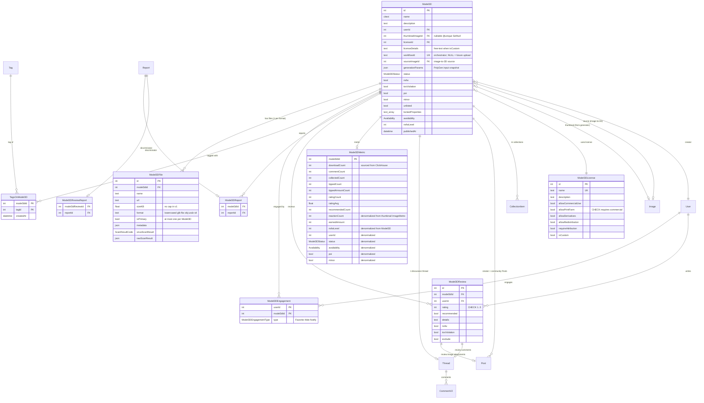
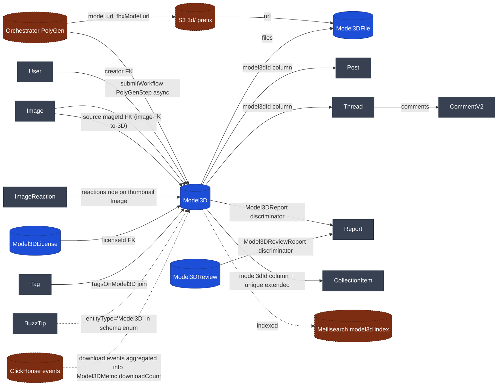
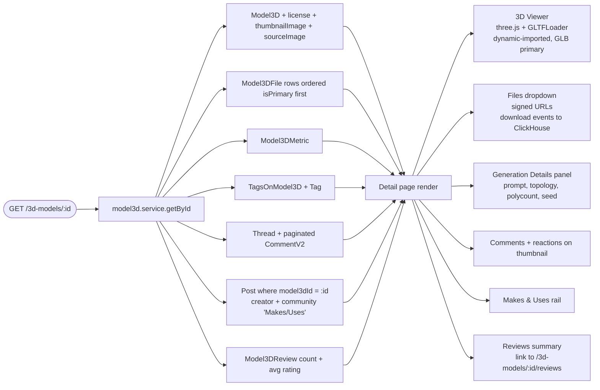

# 3D Models — Schema & Flow Diagrams

Companion to `docs/3d-models-plan.md` (rev 9 — open questions resolved; ready to implement). Visual reference for the new entities, their relationships to existing Civitai tables, and the key user flows.

Diagrams are Mermaid — render inline on GitHub, VS Code (with the **Markdown Preview Mermaid Support** extension), or any modern Markdown viewer.

---

## 1. Entity Relationship Diagram

**Legend**: blue = new tables, grey = existing tables we touch. Cardinality follows Mermaid's `||`, `|o`, `}o`, `}|` notation.

**What's NOT here** (intentional omissions from rev 5):
- ~~`Model3DReaction`~~ — users react to the thumbnail `Image` (which is an existing `Image` row, reusing `ImageReaction`).
- ~~`Model3DDownloadHistory`~~ — download events go to ClickHouse; the rollup denormalizes into `Model3DMetric.downloadCount`.
- ~~`Model3DVersion`~~ — no versioning in v1.

---

## 2. Existing-table touch points

Key points:

- **Reactions reuse `ImageReaction`** on the thumbnail Image — no Model3D-specific reaction table.
- **Downloads go to ClickHouse** as events, not a Postgres table. `Model3DMetric.downloadCount` is a denormalized aggregate.
- **Source of v1 content** is the orchestrator's PolyGen recipe — no upload path in v1.
- **`Image` has two FKs into `Model3D`**: thumbnail (from PolyGen output) and source (for image-to-3D inputs).

---

## 3. Generate + publish lifecycle

```mermaid
flowchart TD
    Start([User opens Generate panel, picks 3D Model]) --> A1[Form: textTo3D or imageTo3D<br/>+ Meshy params: prompt, topology,<br/>polycount, symmetry, PBR, seed]
    A1 --> A1a{Image-to-3D?}
    A1a -- yes --> A1b[Ingest source image as Image row first<br/>mirroring Sora sourceImageSchema]
    A1a -- no --> A2
    A1b --> A2[Submit via submitWorkflow + PolyGenStep<br/>type='polyGen' async]
    A2 --> A3[Orchestrator runs Meshy via Fal<br/>user sees queue card with status]
    A3 --> A4[Workflow result handler fires server-side:<br/>PolyGenOutput model GLB + optional FBX + thumbnail]

    A4 --> B1[Copy blobs to S3 3d/ prefix<br/>handle nullable url + expiry]
    B1 --> B2[Ingest thumbnail as Image row<br/>NSFW + CSAM scan via standard pipeline]
    B2 --> B3[Create Model3D Draft<br/>workflowId set UNIQUE<br/>generationParams snapshot]
    B3 --> B4[Create Model3DFile rows<br/>one per normalized format<br/>GLB isPrimary]
    B4 --> B5[Queue card now shows thumbnail<br/>not inline WebGL]

    B5 --> C1{User clicks 'Post from Generation'?}
    C1 -- no --> Stay([Model3D stays Draft<br/>no public surface])
    C1 -- yes --> D1[Mutation creates empty Post<br/>redirect to /posts/:id/edit]
    D1 --> D2[Edit page hosts Post + Model3D fields:<br/>name description tags license NSFW]
    D2 --> D3[Publish: Model3D.status = Published<br/>Post.model3dId set + flipped to public]
    D3 --> D4[Meilisearch indexed<br/>Model3DMetric initialized]
    D4 --> End([/3d-models/:id live])

    style A2 fill:#1d4ed8,color:#fff
    style B3 fill:#1d4ed8,color:#fff
    style D1 fill:#1d4ed8,color:#fff
    style End fill:#15803d,color:#fff
```

---

## 4. Detail page read path

---

## 5. Cross-reference

| Entity                    | Existing analog        | Difference                                                            |
| ------------------------- | ---------------------- | --------------------------------------------------------------------- |
| `Model3D`                 | `Model`                | No `baseModel`/`ecosystem`/`ModelType`/versioning. Has `workflowId`. |
| `Model3DFile`             | `ModelFile`            | `format String` (not enum), `isPrimary`, `(model3dId, format)` unique |
| `Model3DLicense`          | `License`              | Adds `allowPrintFarm`, `allowRedistribution`, `isCustom`              |
| `Model3DReview`           | `ResourceReview`       | Scoped to `model3dId` (no `modelVersionId`)                           |
| `Model3DReport`           | `ModelReport`          | Identical shape                                                       |
| `Model3DEngagement`       | `ModelEngagement`      | Drops `Mute` from the enum                                            |
| `Model3DMetric`           | `ModelMetric`          | `downloadCount` sourced from ClickHouse; adds rating fields           |
| `TagsOnModel3D`           | `TagsOnModels`         | Identical shape                                                       |
| `Model3D` ↔ `Thread`      | `Model` ↔ `Thread`     | Wide-FK columns added (`model3dId` + `model3dReviewId`)               |
| `Model3D` ↔ `Post`        | `ModelVersion` ↔ `Post`| Wide-FK column added (`Post.model3dId`)                               |
| `Model3D` ↔ `CollectionItem` | `Model` ↔ `CollectionItem` | New FK column + extended unique constraint                  |
| ~~`Model3DReaction`~~     | ~~`ImageReaction`~~    | **Removed** — react on the thumbnail Image instead                    |
| ~~`Model3DDownloadHistory`~~ | ~~`DownloadHistory`~~ | **Removed** — ClickHouse events; rollup in `Model3DMetric`            |
| ~~`Model3DFileType` enum~~| ~~`ModelFile.type`~~   | **Removed** — `format String` for flexibility                         |

---

**Source of truth**: `prisma/schema.full.prisma` (the actual editable Prisma schema; `prisma/schema.prisma` is auto-generated from it via `scripts/generate-slim-schema.js`). Migration SQL is hand-written in `prisma/migrations/20260526120000_add_3d_models/migration.sql` to mirror the schema changes; per CLAUDE.md, it's applied manually rather than via `prisma migrate deploy`. If diagrams drift from the schema, the schema wins.
