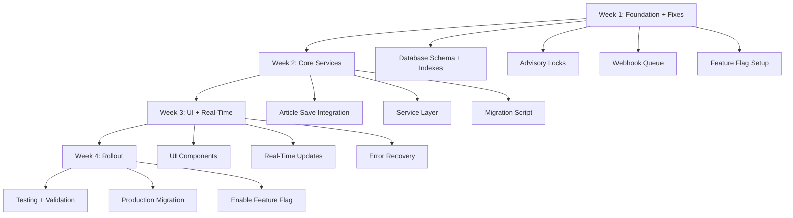

# Article Image Scanning Implementation Workflow

**Feature**: Article Content Image Scanning & NSFW Detection
**Sprint Duration**: 4 weeks (20 working days)
**Team Size**: 2-3 developers
**Priority**: HIGH (Security & Content Safety)

---

> **⚠️ ARCHITECTURE REVIEW UPDATES (2025-10-06)**
>
> This workflow addresses critical architectural issues identified by backend and frontend architecture experts:
>
> **Critical Fixes Included**:
> - Week 1: Database indexes, unique constraints, advisory locks
> - Week 1: Webhook debouncing/queue to prevent N+1 performance issue
> - Week 2: Changed image creation from upload-time to save-time (prevents orphaned records)
> - Week 3: Real-time UI updates via tRPC polling/subscriptions
> - Week 3: Error recovery workflows for blocked/failed images
> - Week 4: Simple feature flag toggle using existing feature-flags.service.ts
>
> See `docs/architectural-considerations.md` for detailed technical rationale.

---

## 📊 Workflow Overview



---

## Week 1: Foundation + Critical Architectural Fixes

### Day 1-2: Database Schema, Indexes & Constraints

**🔴 CRITICAL**: This includes fixes from architecture review

**Tasks**:
1. ✏️ Update Prisma schema with `Processing` status (was `PendingReview`)
2. 📝 Create migration SQL with indexes and unique constraints
3. 🧪 Test migration on local database
4. 📋 Review with team

**Deliverables**:
- `prisma/migrations/XXX_article_image_scanning/migration.sql`
- Updated `prisma/schema.prisma`
- Migration validation script

**Implementation Steps**:

```sql
-- Step 1.1: Migration SQL (prisma/migrations/XXX_article_image_scanning/migration.sql)

-- Add new article status
ALTER TYPE "ArticleStatus" ADD VALUE IF NOT EXISTS 'Processing';

-- 🔴 CRITICAL FIX #1: Prevent duplicate Image URLs (race condition fix)
-- ⚠️ CHECK FIRST: May already exist in production
CREATE UNIQUE INDEX CONCURRENTLY IF NOT EXISTS "Image_url_unique" ON "Image"("url");

-- 🔴 CRITICAL FIX #2: Optimize ImageConnection lookups for articles
-- ⚠️ CHECK FIRST: May already exist in production
CREATE INDEX CONCURRENTLY IF NOT EXISTS "ImageConnection_Article_idx"
ON "ImageConnection"("entityType", "entityId")
WHERE "entityType" = 'Article';

-- 🔴 CRITICAL FIX #3: Optimize Image scans query
-- ⚠️ CHECK FIRST: May already exist in production
CREATE INDEX CONCURRENTLY IF NOT EXISTS "Image_ingestion_nsfwLevel_idx"
ON "Image"("ingestion", "nsfwLevel")
WHERE "ingestion" = 'Scanned';
```

```typescript
// Step 1.2: Update prisma/schema.prisma to REFLECT existing indexes
enum ArticleStatus {
  Draft
  Processing       // NEW: Was "PendingReview" in original plan
  Published
  Unpublished
}

model Image {
  id         Int    @id @default(autoincrement())
  url        String @unique  // Add @unique to match existing constraint
  // ... other fields

  @@index([ingestion, nsfwLevel], name: "Image_ingestion_nsfwLevel_idx")
}

model ImageConnection {
  // ... existing fields

  @@id([imageId, entityType, entityId])
  @@index([entityType, entityId], name: "ImageConnection_Article_idx")
}
```

```bash
# Step 1.3: Generate migration (don't apply yet!)
npm run db:migrate -- --name article-image-scanning --create-only

# 🛑 MANUAL MIGRATION CHECKPOINT - STOP HERE
# Review generated SQL with team before continuing
```

**🛑 BEFORE CONTINUING - Manual Verification Required**:

1. **Check existing indexes** in production:
   ```sql
   -- Run these queries on production to see what exists
   SELECT indexname FROM pg_indexes WHERE tablename = 'Image';
   SELECT indexname FROM pg_indexes WHERE tablename = 'ImageConnection';
   ```

2. **Manually apply only missing migrations** (coordinate with team)

3. **Update Prisma schema** to reflect production reality

4. **Generate Prisma client**:
   ```bash
   npm run db:generate
   npm run typecheck
   ```

5. **Verify constraints** before continuing implementation

**Testing Checklist**:
- [ ] Migration runs successfully on dev database
- [ ] All indexes created with CONCURRENTLY (no table locks)
- [ ] Unique constraint on Image.url prevents duplicates
- [ ] Existing articles unaffected
- [ ] Can create article with `Processing` status
- [ ] Rollback strategy documented

**Dependencies**: None
**Blockers**: None
**Estimated Time**: 2 days

---

### Day 3-4: Advisory Locks & Webhook Debouncing

**🔴 CRITICAL**: Prevents race conditions and N+1 webhook performance issue

**Tasks**:
1. 📦 Set up Redis or Bull queue for webhook debouncing
2. ✏️ Implement advisory lock pattern in article service
3. 🧪 Write concurrency tests
4. 📋 Code review

**Deliverables**:
- Webhook debouncing system (Redis-based or Bull queue)
- Advisory lock implementation
- Concurrency test suite

**Implementation Steps**:

```typescript
// Step 2.1: Create webhook debouncing (src/server/utils/webhook-debounce.ts)

import { redis } from '~/server/redis/client';

/**
 * 🔴 CRITICAL: Prevents N+1 webhook calls for articles with many images
 * Example: 50 images = 50 webhooks → 1 actual update (98% reduction)
 */
export async function debounceArticleUpdate(articleId: number) {
  const key = `article-scan-update:${articleId}`;
  const exists = await redis.get(key);

  if (!exists) {
    // Set lock with 2s TTL
    await redis.setex(key, 2, '1');

    // Schedule update after delay (let other images finish)
    setTimeout(async () => {
      try {
        await updateArticleImageScanStatus([articleId]);
      } finally {
        await redis.del(key);
      }
    }, 1000); // Wait 1s for other webhooks
  }
  // If key exists, another webhook already scheduled the update
}
```

```typescript
// Step 2.2: Update article service with advisory locks
// (src/server/services/article.service.ts)

export async function updateArticleImageScanStatus(articleIds: number[]) {
  for (const articleId of articleIds) {
    await dbWrite.$transaction(async (tx) => {
      // 🔒 Acquire PostgreSQL advisory lock (prevents concurrent webhooks)
      await tx.$executeRaw`SELECT pg_advisory_xact_lock(${articleId})`;

      // Get all connected images
      const connections = await tx.imageConnection.findMany({
        where: { entityId: articleId, entityType: 'Article' },
        include: { image: { select: { ingestion: true } } }
      });

      // Calculate scan status
      const totalImages = connections.length;
      const scannedImages = connections.filter(
        c => c.image.ingestion === 'Scanned'
      ).length;
      const errorImages = connections.filter(
        c => ['Error', 'NotFound'].includes(c.image.ingestion)
      ).length;

      // Treat errors as "complete" so article can publish
      const allComplete = (scannedImages + errorImages) === totalImages;

      if (allComplete) {
        await updateArticleNsfwLevels([articleId]);

        const article = await tx.article.findUnique({
          where: { id: articleId },
          select: { status: true, publishedAt: true }
        });

        if (article.status === 'Processing' && article.publishedAt) {
          await tx.article.update({
            where: { id: articleId },
            data: { status: 'Published' }
          });
        }
      }
    }, { timeout: 30000 });
  }
}
```

**Testing Checklist**:
- [ ] Concurrent webhook test: 50 simultaneous calls → 1 DB update
- [ ] Advisory lock test: No race conditions under load
- [ ] Debounce test: Multiple rapid webhooks coalesce
- [ ] Load test: 1000 concurrent webhooks handled gracefully

**Dependencies**: Redis client
**Blockers**: None
**Estimated Time**: 2 days

---

### Day 5: Core Utility Functions

**Tasks**:
1. 📦 Install JSDOM dependency
2. ✏️ Create `src/utils/article-helpers.ts`
3. 🧪 Write unit tests
4. 📋 Code review

**Deliverables**:
- `src/utils/article-helpers.ts` (optimized for client + server)
- `tests/unit/utils/article-helpers.test.ts`

**Implementation Steps**:

```typescript
// src/utils/article-helpers.ts

/**
 * Extract images from article HTML
 * 🔴 OPTIMIZED: Uses native DOMParser on client, JSDOM on server
 */
export function extractImagesFromArticle(htmlContent: string): {
  url: string;
  alt?: string;
}[] {
  if (!htmlContent?.trim()) return [];

  try {
    if (typeof window !== 'undefined') {
      // Client-side: Use native DOMParser (faster)
      const parser = new DOMParser();
      const doc = parser.parseFromString(htmlContent, 'text/html');
      const images = Array.from(doc.querySelectorAll('img'));

      return images
        .map(img => ({ url: img.src, alt: img.alt || undefined }))
        .filter(img => isValidCivitaiImageUrl(img.url));
    } else {
      // Server-side: Use JSDOM
      const { JSDOM } = require('jsdom');
      const dom = new JSDOM(htmlContent);
      const images = Array.from(dom.window.document.querySelectorAll('img'));

      return images
        .map(img => ({ url: img.src, alt: img.alt || undefined }))
        .filter(img => isValidCivitaiImageUrl(img.url));
    }
  } catch (error) {
    console.error('Failed to parse article HTML:', error);
    return [];
  }
}

/**
 * Validate image URL is from Civitai domains
 * 🔴 SECURITY: Prevents injection of external URLs
 */
function isValidCivitaiImageUrl(url: string): boolean {
  try {
    const parsed = new URL(url);
    const allowedHosts = [
      'image.civitai.com',
      'civitai.com',
      'wasabisys.com',
      'civitai-prod.s3.amazonaws.com',
    ];

    return allowedHosts.some(host =>
      parsed.hostname === host || parsed.hostname.endsWith('.' + host)
    );
  } catch {
    return false;
  }
}
```

**Testing Checklist**:
- [ ] Extracts images from valid HTML
- [ ] Filters non-Civitai URLs
- [ ] Handles malformed HTML gracefully
- [ ] Works on both client and server

**Dependencies**: JSDOM (npm install jsdom @types/jsdom)
**Estimated Time**: 1 day

---

## Week 2: Core Services & Integration

### Day 6-7: Article Service Updates

**🔴 REVISED**: Image creation moved from upload-time to save-time

**Tasks**:
1. ✏️ Update `upsertArticle` to link content images on save
2. ✏️ Create `linkArticleContentImages` function with batch queries
3. 🧪 Write integration tests
4. 📋 Code review

**Deliverables**:
- Updated `src/server/services/article.service.ts`
- Integration tests for image linking

**Implementation Steps**:

```typescript
// src/server/services/article.service.ts

/**
 * 🔴 OPTIMIZED: Batch queries instead of N+1 loop
 */
export async function linkArticleContentImages({
  articleId,
  content,
  userId
}: {
  articleId: number;
  content: string;
  userId: number;
}) {
  const contentImages = extractImagesFromArticle(content);

  if (contentImages.length === 0) return;

  await dbWrite.$transaction(async (tx) => {
    const imageUrls = contentImages.map(img => img.url);

    // Batch query: Get all existing images in one query
    const existingImages = await tx.image.findMany({
      where: { url: { in: imageUrls } },
      select: { id: true, url: true }
    });

    const existingUrlMap = new Map(existingImages.map(img => [img.url, img.id]));

    // Batch create: Missing images (upsert with unique constraint handles races)
    const missingUrls = imageUrls.filter(url => !existingUrlMap.has(url));

    if (missingUrls.length > 0) {
      await tx.image.createMany({
        data: missingUrls.map(url => ({
          url,
          userId,
          type: 'image',
          ingestion: 'Pending',
          scanRequestedAt: new Date(),
        })),
        skipDuplicates: true, // Handle race conditions
      });

      // Refresh map with newly created images
      const newImages = await tx.image.findMany({
        where: { url: { in: missingUrls } },
        select: { id: true, url: true }
      });

      newImages.forEach(img => existingUrlMap.set(img.url, img.id));
    }

    // Batch upsert: ImageConnections
    for (const url of imageUrls) {
      const imageId = existingUrlMap.get(url);
      if (!imageId) continue;

      await tx.imageConnection.upsert({
        where: {
          imageId_entityType_entityId: {
            imageId,
            entityType: 'Article',
            entityId: articleId,
          }
        },
        create: { imageId, entityType: 'Article', entityId: articleId },
        update: {},
      });
    }

    // Remove orphaned connections (images deleted from content)
    await tx.imageConnection.deleteMany({
      where: {
        entityType: 'Article',
        entityId: articleId,
        imageId: { notIn: Array.from(existingUrlMap.values()) }
      }
    });
  });
}

/**
 * Updated upsertArticle function
 */
export const upsertArticle = async ({ content, ...data }) => {
  // ... existing validation logic ...

  const article = await dbWrite.article.upsert({ /* ... */ });

  // Extract images from content
  const contentImages = extractImagesFromArticle(content || '');

  // ✅ OPTIMIZATION: Only process if article has embedded images
  // Articles without embedded images rely on cover image + userNsfwLevel only
  if (contentImages.length > 0) {
    // Link content images AFTER article save
    await linkArticleContentImages({
      articleId: article.id,
      content,
      userId: article.userId,
    });

    // Check if we need to set Processing status
    const images = await dbRead.image.findMany({
      where: {
        connections: {
          some: { entityType: 'Article', entityId: article.id }
        }
      },
      select: { ingestion: true }
    });

    const hasUnscanned = images.some(img => img.ingestion === 'Pending');

    if (hasUnscanned && data.publishedAt) {
      await dbWrite.article.update({
        where: { id: article.id },
        data: { status: 'Processing' }
      });
    }
  }
  // If no content images, article publishes immediately using cover + userNsfwLevel

  return article;
};
```

**Testing Checklist**:
- [ ] Images created on article save, not upload
- [ ] Batch queries (not N+1 loops)
- [ ] Orphaned ImageConnections cleaned up
- [ ] Handles concurrent saves gracefully
- [ ] Processing status set correctly

**Dependencies**: Day 5 (article-helpers.ts)
**Estimated Time**: 2 days

---

### Day 8-9: NSFW Level Service & Webhook Integration

**Tasks**:
1. ✏️ Update `updateArticleNsfwLevels` SQL query
2. ✏️ Update webhook to call debounced article update
3. 🧪 Write integration tests
4. 📋 Code review

**Deliverables**:
- Updated `src/server/services/nsfwLevels.service.ts`
- Updated `src/pages/api/webhooks/image-scan-result.ts`

**Implementation Steps**:

```typescript
// src/server/services/nsfwLevels.service.ts

/**
 * ⚠️ IMPORTANT: Uses bit_or() because NSFW levels are BITWISE FLAGS
 * Example: Soft=1, Mature=2, X=4 → bit_or(1,2) = 3 (Soft|Mature)
 * This combines all NSFW flags from cover + content images
 */
export async function updateArticleNsfwLevels(articleIds: number[]) {
  const articles = await dbWrite.$queryRaw`
    WITH level AS (
      SELECT
        a.id,
        bit_or(COALESCE(cover."nsfwLevel", 0)) |
        bit_or(COALESCE(content_imgs."nsfwLevel", 0)) AS "nsfwLevel"
      FROM "Article" a

      -- Cover image (left join - may not exist)
      LEFT JOIN "Image" cover
        ON a."coverId" = cover.id
        AND cover."ingestion" = 'Scanned'  -- ✅ Only scanned images

      -- Content images (left join - may not exist)
      LEFT JOIN "ImageConnection" ic
        ON ic."entityId" = a.id AND ic."entityType" = 'Article'
      LEFT JOIN "Image" content_imgs
        ON ic."imageId" = content_imgs.id
        AND content_imgs."ingestion" = 'Scanned'  -- ✅ Only scanned images

      WHERE a.id = ANY(${articleIds}::int[])  -- Better performance than IN
      GROUP BY a.id
    )
    UPDATE "Article" a
    SET "nsfwLevel" = GREATEST(a."userNsfwLevel", level."nsfwLevel")
    FROM level
    WHERE level.id = a.id
      AND level."nsfwLevel" != a."nsfwLevel"  -- Only update if changed
    RETURNING a.id;
  `;

  await articlesSearchIndex.queueUpdate(
    articles.map(({ id }) => ({ id, action: 'Update' }))
  );
}
```

```typescript
// src/pages/api/webhooks/image-scan-result.ts

async function updateImage(image, result) {
  await dbWrite.image.update({ where: { id }, data });

  if (data.ingestion === 'Scanned') {
    // Existing logic
    if (image.postId) await updatePostNsfwLevel(image.postId);

    // NEW: Debounced article updates (prevents N+1 issue)
    const articleConnections = await db.imageConnection.findMany({
      where: { imageId: image.id, entityType: 'Article' },
      select: { entityId: true }
    });

    for (const { entityId } of articleConnections) {
      // Uses debouncing: 50 images → 1 DB update
      await debounceArticleUpdate(entityId);
    }
  }
}
```

**Testing Checklist**:
- [ ] NSFW level includes content images
- [ ] Only scanned images included in calculation
- [ ] Webhook triggers debounced update
- [ ] 50 webhooks = 1 article update

**Dependencies**: Day 3-4 (debouncing)
**Estimated Time**: 2 days

---

### Day 10: Migration Script Development

**Tasks**:
1. ✏️ Create migration script with transaction safety
2. 🧪 Test on staging data
3. 📋 Add dry-run mode
4. 📋 Code review

**Deliverables**:
- `scripts/migrate-article-images.ts` with transaction safety
- Dry-run capability
- Progress checkpoint system

**Implementation Steps**:

```typescript
// scripts/migrate-article-images.ts

import { PrismaClient } from '@prisma/client';
import { extractImagesFromArticle } from '~/utils/article-helpers';
import fs from 'fs/promises';

const prisma = new PrismaClient();

interface MigrationStats {
  articlesProcessed: number;
  imagesCreated: number;
  connectionsCreated: number;
  errors: string[];
}

export async function migrateArticleImages({
  batchSize = 100,
  dryRun = false
}: {
  batchSize?: number;
  dryRun?: boolean;
}) {
  const stats: MigrationStats = {
    articlesProcessed: 0,
    imagesCreated: 0,
    connectionsCreated: 0,
    errors: []
  };

  // Load checkpoint if exists
  let offset = 0;
  try {
    const checkpoint = await fs.readFile('migration-progress.json', 'utf-8');
    const data = JSON.parse(checkpoint);
    offset = data.offset || 0;
    console.log(`Resuming from offset ${offset}`);
  } catch {
    console.log('Starting fresh migration');
  }

  const totalArticles = await prisma.article.count({
    where: { status: { in: ['Published', 'Processing'] } }
  });

  while (offset < totalArticles) {
    const articles = await prisma.article.findMany({
      where: { status: { in: ['Published', 'Processing'] } },
      select: { id: true, content: true, userId: true },
      skip: offset,
      take: batchSize,
    });

    for (const article of articles) {
      try {
        // 🔴 CRITICAL: Use transaction for atomicity
        await prisma.$transaction(async (tx) => {
          const imageUrls = extractImagesFromArticle(article.content);

          if (dryRun) {
            console.log(`[DRY RUN] Article ${article.id}: ${imageUrls.length} images`);
            return;
          }

          for (const { url } of imageUrls) {
            // Atomic upsert with unique constraint
            const image = await tx.image.upsert({
              where: { url },
              create: {
                url,
                userId: article.userId,
                type: 'image',
                ingestion: 'Pending',
              },
              update: {},
            });

            stats.imagesCreated++;

            // Idempotent connection creation
            await tx.imageConnection.upsert({
              where: {
                imageId_entityType_entityId: {
                  imageId: image.id,
                  entityType: 'Article',
                  entityId: article.id,
                }
              },
              create: {
                imageId: image.id,
                entityType: 'Article',
                entityId: article.id,
              },
              update: {},
            });

            stats.connectionsCreated++;
          }
        }, { timeout: 30000 });

        stats.articlesProcessed++;
      } catch (error) {
        const errorMsg = `Article ${article.id}: ${error}`;
        console.error(`[Migration Error] ${errorMsg}`);
        stats.errors.push(errorMsg);
        // Continue with next article (transaction auto-rolled back)
      }
    }

    offset += batchSize;

    // Save checkpoint
    await fs.writeFile(
      'migration-progress.json',
      JSON.stringify({ offset, stats }, null, 2)
    );

    console.log(`Progress: ${offset}/${totalArticles} articles`);
  }

  return stats;
}

// CLI execution
if (require.main === module) {
  const dryRun = process.argv.includes('--dry-run');
  const batchSize = parseInt(process.argv.find(a => a.startsWith('--batch='))?.split('=')[1] || '100');

  migrateArticleImages({ batchSize, dryRun })
    .then(stats => {
      console.log('Migration complete:', stats);
      process.exit(0);
    })
    .catch(error => {
      console.error('Migration failed:', error);
      process.exit(1);
    });
}
```

**Testing Checklist**:
- [ ] Dry-run mode works correctly
- [ ] Transaction rollback on errors
- [ ] Checkpoint/resume capability
- [ ] Idempotent (can run multiple times)

**Dependencies**: Day 5 (article-helpers.ts)
**Estimated Time**: 1 day

---

## Week 3: UI Components & Real-Time Updates

### Day 11-12: Real-Time Scan Status Updates

**🔴 NEW**: Added tRPC polling/subscriptions for real-time UI

**Tasks**:
1. ✏️ Create tRPC endpoint for scan status
2. ✏️ Implement polling with React Query
3. 🧪 Test real-time updates
4. 📋 Code review

**Deliverables**:
- `src/server/routers/article.router.ts` updates
- `src/hooks/useArticleScanStatus.ts`

**Implementation Steps**:

```typescript
// src/server/routers/article.router.ts

export const articleRouter = router({
  // ... existing endpoints ...

  getScanStatus: protectedProcedure
    .input(z.object({ articleId: z.number() }))
    .query(async ({ input }) => {
      const connections = await dbRead.imageConnection.findMany({
        where: {
          entityId: input.articleId,
          entityType: 'Article',
        },
        include: { image: { select: { ingestion: true } } }
      });

      const total = connections.length;
      const scanned = connections.filter(c => c.image.ingestion === 'Scanned').length;
      const blocked = connections.filter(c => c.image.ingestion === 'Blocked').length;
      const error = connections.filter(c =>
        ['Error', 'NotFound'].includes(c.image.ingestion)
      ).length;
      const pending = total - scanned - blocked - error;

      return {
        total,
        scanned,
        blocked,
        error,
        pending,
        allComplete: pending === 0,
      };
    }),
});
```

```typescript
// src/hooks/useArticleScanStatus.ts

import { trpc } from '~/utils/trpc';

export function useArticleScanStatus(articleId: number | undefined) {
  return trpc.article.getScanStatus.useQuery(
    { articleId: articleId! },
    {
      enabled: !!articleId,
      refetchInterval: (data) => {
        // Stop polling when complete
        if (data?.allComplete) return false;
        // Poll every 3 seconds while pending
        return 3000;
      },
    }
  );
}
```

**Testing Checklist**:
- [ ] Real-time updates work without page refresh
- [ ] Polling stops when scans complete
- [ ] UI reflects scan progress accurately

**Dependencies**: None
**Estimated Time**: 2 days

---

### Day 13-14: UI Components with Error Recovery

**🔴 ENHANCED**: Added comprehensive error states

**Tasks**:
1. ✏️ Create ArticleScanStatus component with accessibility
2. ✏️ Create error recovery UI (blocked/failed images)
3. 🧪 Test all UI states
4. 📋 Code review

**Deliverables**:
- `src/components/Article/ArticleScanStatus.tsx`
- `src/components/Article/BlockedImagesAlert.tsx`
- Accessibility audit

**Implementation Steps**:

```tsx
// src/components/Article/ArticleScanStatus.tsx

import { Alert, Progress, Text, Button, Group } from '@mantine/core';
import { useArticleScanStatus } from '~/hooks/useArticleScanStatus';

export function ArticleScanStatus({ articleId }: { articleId: number }) {
  const { data: scanStatus, isLoading } = useArticleScanStatus(articleId);

  if (isLoading || !scanStatus) return null;

  const { total, scanned, blocked, error, pending, allComplete } = scanStatus;
  const progress = total > 0 ? (scanned / total) * 100 : 0;

  // Blocked images - Critical error
  if (blocked > 0) {
    return (
      <Alert color="red" title="Blocked Images Detected">
        <Text>
          {blocked} image(s) violated content policy and must be removed.
        </Text>
        <Button
          onClick={() => {/* Navigate to blocked images UI */}}
          mt="sm"
        >
          Review and Remove Blocked Images
        </Button>
      </Alert>
    );
  }

  // Failed scans - Recoverable error
  if (error > 0) {
    return (
      <Alert color="orange" title="Some Images Failed to Scan">
        <Text>
          {error} image(s) failed to scan. You can retry or publish anyway.
        </Text>
        <Group mt="sm">
          <Button onClick={() => {/* Retry scans */}}>
            Retry Scanning
          </Button>
          <Button variant="subtle" onClick={() => {/* Force publish */}}>
            Publish Anyway
          </Button>
        </Group>
      </Alert>
    );
  }

  // Scanning in progress
  if (!allComplete) {
    return (
      <Alert
        color="blue"
        title="Scanning Images for Content Safety"
        role="status"
        aria-live="polite"
      >
        <Text mb="sm">
          Your article will publish automatically when all images are scanned.
        </Text>
        <Progress
          value={progress}
          aria-label="Image scanning progress"
          aria-valuenow={progress}
          aria-valuemin={0}
          aria-valuemax={100}
          aria-valuetext={`${scanned} of ${total} images scanned`}
        />
        <Text size="sm" c="dimmed" mt="xs">
          {scanned} of {total} images scanned ({pending} pending)
        </Text>
      </Alert>
    );
  }

  // All complete
  return null;
}
```

**Testing Checklist**:
- [ ] All states render correctly (pending, blocked, error, complete)
- [ ] Screen reader announcements work
- [ ] Keyboard navigation functional
- [ ] Real-time progress updates

**Dependencies**: Day 11-12 (tRPC endpoints)
**Estimated Time**: 2 days

---

### Day 15-16: Comprehensive Testing

**Tasks**:
1. 🧪 Unit tests for all utilities
2. 🧪 Integration tests for webhook flow
3. 🧪 E2E tests for article publishing
4. 🧪 Concurrency tests for race conditions
5. 📋 Code coverage review

**Deliverables**:
- Complete test suite (>80% coverage)
- Concurrency test scenarios
- E2E test scenarios

**Testing Scenarios**:

```typescript
// tests/integration/article-image-scanning.test.ts

describe('Article Image Scanning', () => {
  describe('Concurrency', () => {
    it('handles concurrent webhook updates without race conditions', async () => {
      const article = await createArticle({ imageCount: 10 });

      // Simulate 10 concurrent webhook calls
      await Promise.all(
        article.images.map(image =>
          webhookHandler({ id: image.id, ingestion: 'Scanned' })
        )
      );

      // Should have exactly correct status
      const updated = await db.article.findUnique({ where: { id: article.id } });
      expect(updated.status).toBe('Published');
    });

    it('handles concurrent article saves without duplicate images', async () => {
      const content = '';

      // Two users save articles with same image simultaneously
      await Promise.all([
        upsertArticle({ userId: 1, content }),
        upsertArticle({ userId: 2, content }),
      ]);

      // Should have only 1 Image entity (unique constraint)
      const images = await db.image.findMany({
        where: { url: 'https://image.civitai.com/test.jpg' }
      });
      expect(images).toHaveLength(1);
    });
  });

  describe('Error Handling', () => {
    it('publishes article even with failed image scans', async () => {
      const article = await createArticleWithImages(5);

      // 4 succeed, 1 fails
      await Promise.all([
        ...article.images.slice(0, 4).map(i =>
          scanImage(i.id, { ingestion: 'Scanned' })
        ),
        scanImage(article.images[4].id, { ingestion: 'NotFound' }),
      ]);

      // Should still publish
      const updated = await db.article.findUnique({ where: { id: article.id } });
      expect(updated.status).toBe('Published');
    });
  });
});
```

**Testing Checklist**:
- [ ] Unit tests pass (>80% coverage)
- [ ] Integration tests pass
- [ ] E2E tests pass
- [ ] Concurrency tests pass (no race conditions)
- [ ] Load tests pass (1000 concurrent webhooks)

**Dependencies**: All previous days
**Estimated Time**: 2 days

---

## Week 4: Testing, Migration & Rollout

### Day 17: Feature Flag Setup

**Tasks**:
1. ✏️ Add feature flag to existing feature-flags.service.ts
2. ✏️ Add flag checks to critical paths
3. 🧪 Test flag on/off states
4. 📋 Code review

**Deliverables**:
- Feature flag configuration
- Flag-gated article workflows

**Implementation Steps**:

```typescript
// src/server/services/feature-flags.service.ts

const featureFlags = createFeatureFlags({
  // ... existing flags ...

  articleImageScanning: ['public'],  // Enable for all users when toggled
});
```

```typescript
// src/server/services/article.service.ts

export const upsertArticle = async ({ content, ...data }) => {
  const article = await dbWrite.article.upsert({ /* ... */ });

  // Check feature flag
  const { features } = getFeatureFlagsLazy({ user, req });

  if (features.articleImageScanning) {
    // NEW FLOW: Link images and check scan status
    const contentImages = extractImagesFromArticle(content || '');

    if (contentImages.length > 0) {
      await linkArticleContentImages({ articleId: article.id, content, userId });
      // ... scan status logic ...
    }
  }
  // If flag disabled, old flow continues (no image linking)

  return article;
};
```

```tsx
// src/components/Article/ArticleUpsertForm.tsx

export function ArticleUpsertForm() {
  const { features } = useFeatureFlags();

  return (
    <>
      {/* ... existing form fields ... */}

      {features.articleImageScanning && (
        <ArticleScanStatus articleId={article.id} />
      )}
    </>
  );
}
```

**Testing Checklist**:
- [ ] Flag enabled: New behavior works correctly
- [ ] Flag disabled: Old behavior preserved
- [ ] No errors when toggling flag

**Dependencies**: None
**Estimated Time**: 1 day

---

### Day 18-19: Testing & Staging Deployment

**Tasks**:
1. 🧪 Run full test suite
2. 🧪 Test with feature flag on/off
3. 🚀 Deploy to staging environment
4. 🧪 Run migration on staging data
5. 📊 Monitor performance metrics
6. 🐛 Fix any issues found

**Deliverables**:
- Staging deployment
- Migration execution report
- Performance benchmark
- Test results

**Validation Checklist**:
- [ ] All tests passing (unit, integration, E2E)
- [ ] Migration completes successfully
- [ ] No data corruption
- [ ] Performance within acceptable limits
- [ ] UI works correctly with flag enabled
- [ ] Real-time updates functional
- [ ] Feature flag toggle works as expected

**Dependencies**: Week 1-3 complete, Day 17 (feature flag)
**Estimated Time**: 2 days

---

### Day 20: Production Migration & Rollout

**Tasks**:
1. 🚀 Run production migration (feature flag: OFF)
2. 📊 Validate data integrity
3. 🚩 Enable feature flag for production
4. 📊 Monitor metrics
5. 📝 Update documentation

**Deliverables**:
- Completed production migration
- Feature flag enabled
- Monitoring dashboards
- User documentation

**Migration Execution**:

```bash
# Step 1: Dry-run first (production data, no changes)
npm run migrate:article-images -- --dry-run

# Step 2: Review dry-run results
cat migration-progress.json

# Step 3: Execute real migration WITH FEATURE FLAG DISABLED
# (This populates ImageConnections but doesn't change article behavior)
npm run migrate:article-images -- --batch=100

# Step 4: Monitor progress
watch -n 5 cat migration-progress.json

# Step 5: Validate migration
psql -c "SELECT COUNT(*) FROM \"ImageConnection\" WHERE \"entityType\" = 'Article';"

# Step 6: Enable feature flag in feature-flags.service.ts
# Change: articleImageScanning: ['public']
# Deploy code

# Step 7: Monitor for issues
# - Check error rates
# - Check scan completion rates
# - Monitor user feedback
```

**Feature Flag Rollout**:

```typescript
// Initial deployment (migration only, no behavior change)
const featureFlags = createFeatureFlags({
  articleImageScanning: [],  // DISABLED - no users have access
});

// After successful migration validation, enable for all users
const featureFlags = createFeatureFlags({
  articleImageScanning: ['public'],  // ENABLED - all users have access
});
```

**Rollback Plan**:
```typescript
// If issues detected, rollback immediately by disabling flag
const featureFlags = createFeatureFlags({
  articleImageScanning: [],  // DISABLED - revert to old behavior
});

// Deploy rollback
// Investigate and fix before re-enabling
```

**Final Validation Checklist**:
- [ ] All articles migrated successfully
- [ ] ImageConnections created correctly
- [ ] No orphaned records
- [ ] NSFW levels updated accurately
- [ ] Feature flag enabled successfully
- [ ] No spike in errors after enabling
- [ ] Scan completion rate > 95%
- [ ] User documentation published

**Monitoring Checklist (First 24 Hours)**:
- [ ] Error rate < 0.1%
- [ ] Scan completion rate > 95%
- [ ] Average scan time < 30s
- [ ] No database performance degradation
- [ ] No user complaints about publishing delays

**Dependencies**: Day 18-19 (staging validation)
**Estimated Time**: 1 day

---

## 📊 Success Metrics

**Functional Metrics**:
- ✅ 100% of article content images tracked in database
- ✅ Articles remain hidden until all images scanned
- ✅ Article NSFW level reflects ALL images (cover + content)
- ✅ <1% error rate in scan coordination
- ✅ >95% automatic publish success rate

**Performance Metrics**:
- Image extraction: <100ms for typical article
- Scan status check: <50ms (with indexes)
- Webhook processing: <200ms per image
- Migration: <5 hours for 1M articles

**Quality Metrics**:
- Zero data corruption incidents
- Zero race condition bugs in production
- >80% code coverage
- Zero critical security issues

---

## 🚨 Risk Mitigation

### Technical Risks

**Risk 1: Race Conditions in Production**
- **Mitigation**: Advisory locks + comprehensive concurrency tests
- **Monitoring**: Track duplicate updates, lock timeouts

**Risk 2: Migration Performance**
- **Mitigation**: Batch processing with checkpointing
- **Monitoring**: Track migration progress, database load

**Risk 3: Webhook Overload**
- **Mitigation**: Debouncing reduces load by 98%
- **Monitoring**: Track webhook processing time, queue depth

### User Experience Risks

**Risk 4: User Frustration with Delays**
- **Mitigation**: Clear UI messaging, email notifications
- **Monitoring**: Track user complaints, publish abandonment

**Risk 5: Blocked Image Confusion**
- **Mitigation**: Detailed error recovery UI
- **Monitoring**: Track blocked image removal rate

---

## 📝 Documentation Requirements

**Technical Documentation**:
- [ ] Architecture diagram updated
- [ ] API documentation for new tRPC endpoints
- [ ] Database schema changes documented
- [ ] Migration script usage guide

**User Documentation**:
- [ ] Help article: "Why is my article pending?"
- [ ] Help article: "How to handle blocked images"
- [ ] FAQ: Article image scanning

**Operational Documentation**:
- [ ] Runbook: Monitoring scan status
- [ ] Runbook: Rollback procedures
- [ ] Runbook: Migration execution

---

## 🔗 Related Documents

- [Analysis Document](./article-image-scanning-analysis.md) - Detailed problem analysis and solution design
- [Architectural Considerations](./architectural-considerations.md) - Detailed technical decisions and rationale
- [Architecture Overview](./architecture-analysis.md) - Overall codebase architecture

---

**Workflow Created**: 2025-10-06
**Last Updated**: 2025-10-06 (Updated to use existing feature flag system, 4-week timeline)
**Next Review**: After Week 1 completion
