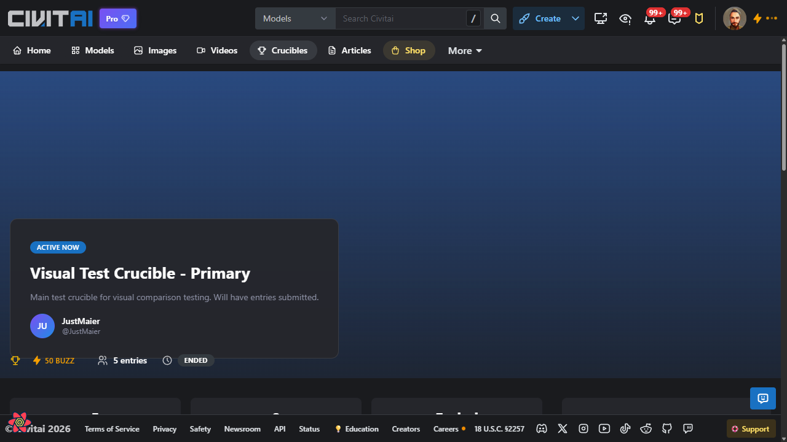
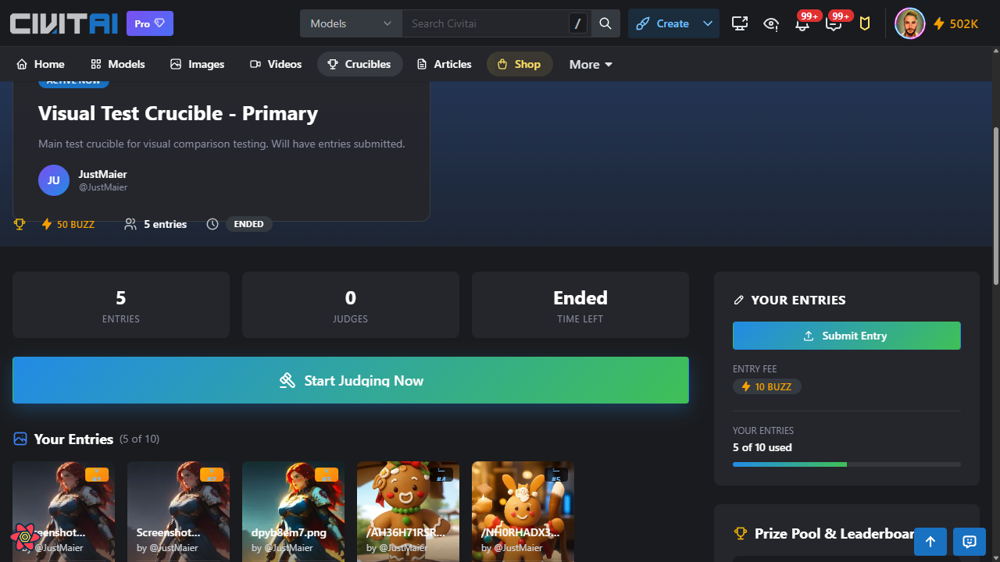
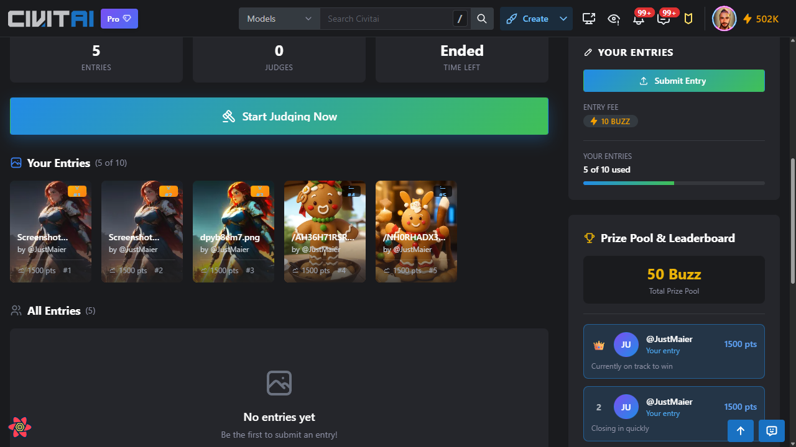
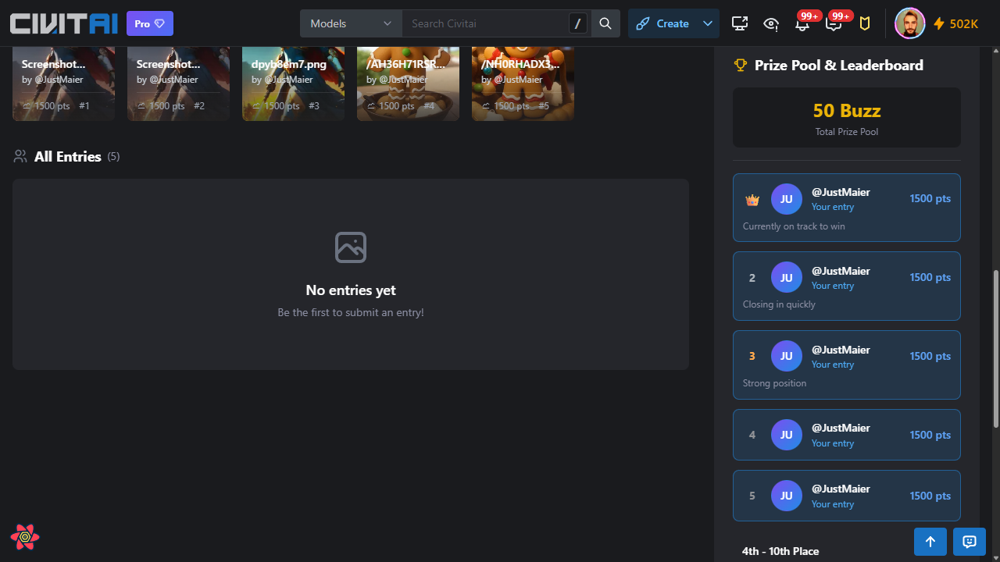
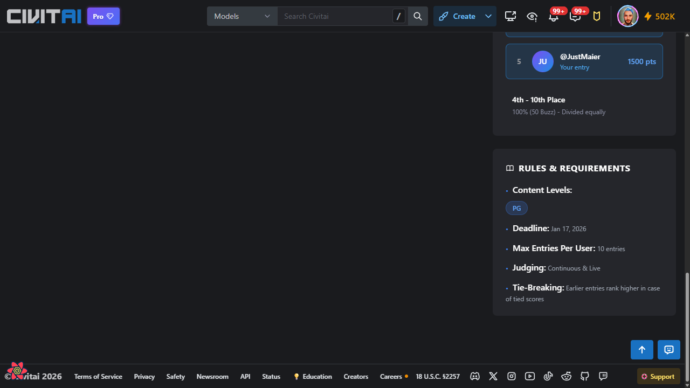
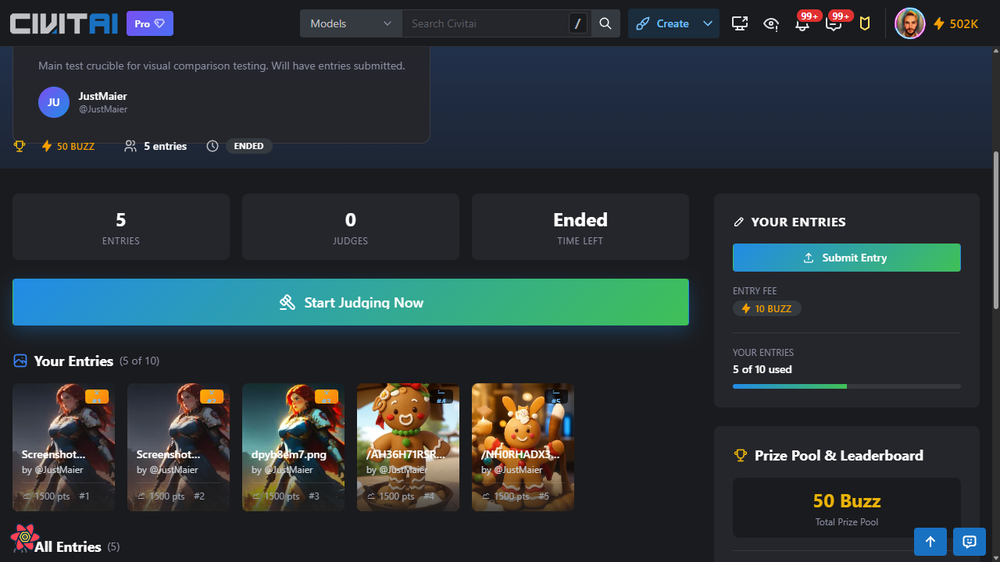

# Crucible Landing Page Browser Flow

This document captures the crucible landing/detail page interface with full-page screenshots for review.

**Date**: January 17, 2026
**Profile**: member (authenticated user)
**Test URL**: http://localhost:3000/crucibles/10

## Summary

The landing page provides a comprehensive view of a single crucible, including:
- Hero section with background image and crucible details
- Stats grid (entries, judges, time remaining)
- User's entries section with submission functionality
- Leaderboard showing rankings
- Rules and requirements sidebar

## Screenshots

### 1. Hero Section



**Elements visible:**
- "ACTIVE NOW" status badge
- Crucible title: "Visual Test Crucible - Primary"
- Description text
- Creator info (avatar, username)
- Quick stats: 50 BUZZ prize, 5 entries, "ENDED" status

### 2. Stats Grid & Actions



**Elements visible:**
- **Stats Grid** (3 columns):
  - 5 ENTRIES
  - 0 JUDGES
  - "Ended" TIME LEFT
- **"Start Judging Now"** CTA button (teal/green, prominent)
- **YOUR ENTRIES** sidebar panel:
  - "Submit Entry" button
  - Entry Fee: 10 BUZZ
  - Progress: "5 of 10 used" with progress bar
- **Your Entries** section header showing "(5 of 10)"
- Entry thumbnail cards with rank badges (#1, #2, etc.)

### 3. Leaderboard Section



**Elements visible:**
- **Your Entries** row of cards with rankings and points
- **All Entries (5)** section - shows "No entries yet" placeholder (potential bug - entries exist)
- **Prize Pool & Leaderboard** sidebar:
  - "50 Buzz Total Prize Pool"
  - Leaderboard entries with avatars, usernames, and points
  - Position labels: #1 (crown icon), #2, etc.
  - Status messages: "Currently on track to win", "Closing in quickly"

### 4. All Entries Grid



**Elements visible:**
- Full leaderboard showing positions 1-5
- Each entry shows: rank, avatar, username, "Your entry" label, points
- Status messages for each position
- **4th - 10th Place** prize tier: "100% (50 Buzz) - Divided equally"

### 5. Rules & Requirements



**RULES & REQUIREMENTS** sidebar showing:
- **Content Levels**: PG badge
- **Deadline**: Jan 17, 2026
- **Max Entries Per User**: 10 entries
- **Judging**: Continuous & Live
- **Tie-Breaking**: Earlier entries rank higher in case of tied scores

### 6. Your Entries Sidebar (Detail View)



Combined view showing:
- Stats grid with all counters
- "Start Judging Now" CTA
- **YOUR ENTRIES** sidebar with:
  - Submit Entry button
  - Entry fee display
  - Usage counter with progress bar
- Entry cards with metadata (filename, author, points, rank)

---

## Reproduction Steps

1. **Start browser session**
   ```bash
   curl -X POST http://localhost:9222/sessions \
     -d '{"name": "landing", "url": "http://localhost:3000/crucibles", "profile": "member"}'
   ```

2. **Navigate to crucible landing page**
   ```bash
   curl -X POST "http://localhost:9222/navigate?session=landing" \
     -d '{"url": "http://localhost:3000/crucibles/10", "fullPage": true}'
   ```

3. **Scroll through page sections**
   ```javascript
   // Civitai uses internal scroll container
   const container = await page.$(".scroll-area.flex-1");

   // Stats grid (scrollTop: 300)
   await container.evaluate(el => el.scrollTop = 300);

   // Leaderboard (scrollTop: 600)
   await container.evaluate(el => el.scrollTop = 600);

   // All entries (scrollTop: 900)
   await container.evaluate(el => el.scrollTop = 900);

   // Rules section (scrollTop: 1200-1500)
   await container.evaluate(el => el.scrollTop = 1500);
   ```

4. **Take screenshots at each position**
   Use `/inspect?fullPage=true` or check session screenshots folder

5. **Clean up**
   ```bash
   curl -X DELETE "http://localhost:9222/sessions/landing"
   ```

---

## Key Observations

### UI Components
- **Stats Grid**: Three-column layout with large numbers and labels
- **CTA Button**: "Start Judging Now" - prominent teal/green button
- **Sidebar**: Sticky on desktop, contains entry submission and leaderboard
- **Entry Cards**: Show thumbnail, filename, author, points, and rank badge
- **Leaderboard**: Numbered list with avatars, contextual status messages

### Potential Issues Noted
1. **"All Entries" shows empty state** despite having 5 entries visible in "Your Entries" - this may be a filtering issue or bug
2. **All 5 entries show same points (1500 pts)** and same author - expected for test data

### Design Patterns
- Dark theme with high contrast text
- Teal/green accent color for primary CTAs
- Badge system for rankings (#1 with crown, numbered for others)
- Progress bar for entry usage limit
- Content level badges (PG, etc.)
