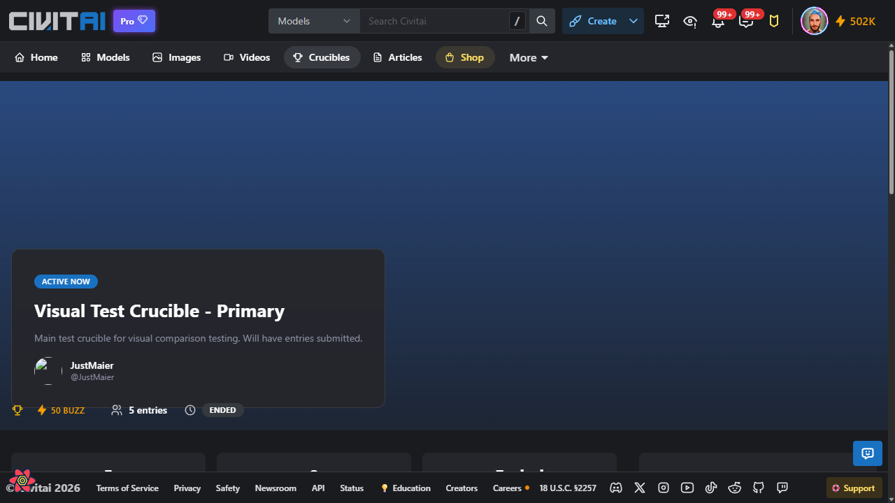
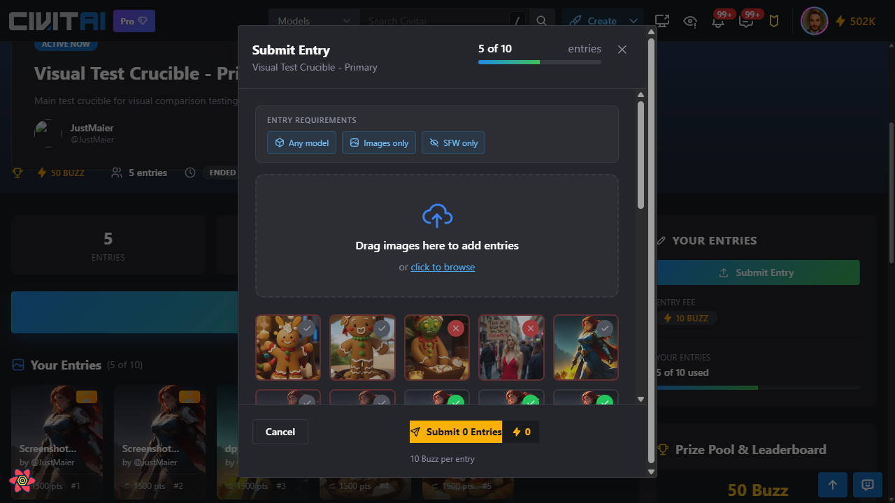
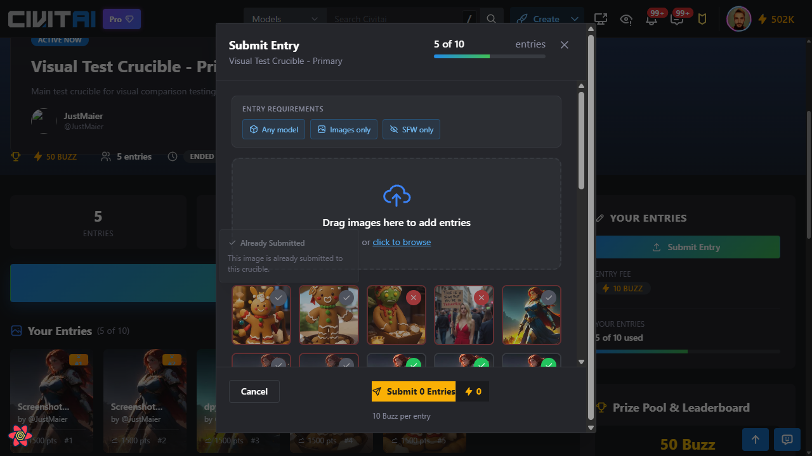
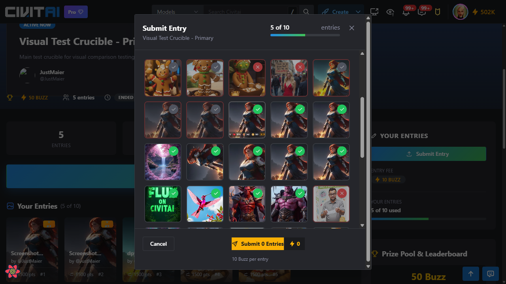
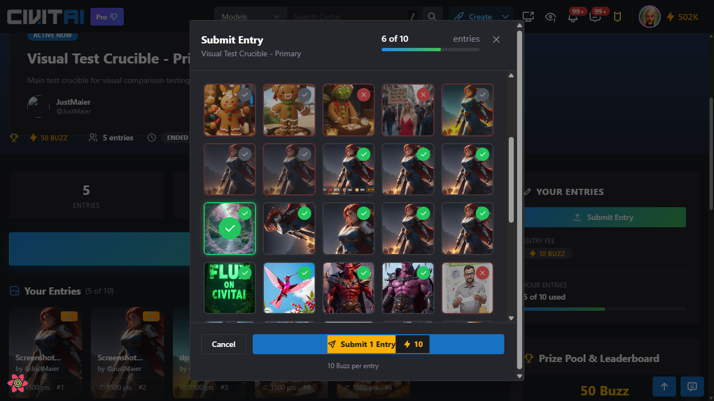

# Crucible Entry Submission Flow

**Flow ID**: 03-submission-flow
**Created**: 2026-01-17
**Profile**: member
**Base URL**: http://localhost:3000

## Overview

This flow documents the entry submission modal and its states, including the drop zone, image grid with valid/invalid indicators, selection state, and submit button with Buzz cost.

## Screenshots

### 1. Landing Page Before Modal


The crucible landing page with the "Submit Entry" button visible in the sidebar.

### 2. Modal with Drop Zone


The submission modal showing:
- **Header**: "Submit Entry" with entry counter (e.g., "5 of 10 entries")
- **Entry Requirements**: Badges showing "Any model", "Images only", "SFW only"
- **Drop Zone**: Large area with upload icon and "Drag images here to add entries" text with "click to browse" link
- **Image Grid**: User's images with validity indicators
- **Footer**: Cancel button and Submit button with Buzz cost indicator

### 3. Already Submitted Tooltip


When hovering over an image with a gray checkmark (already submitted):
- Shows tooltip: "Already Submitted - This image is already submitted to this crucible."
- These images cannot be selected again

### 4. Image Grid with Valid/Invalid Indicators


The image grid showing different indicator states:
- **Gray checkmark**: Already submitted to this crucible
- **Green checkmark**: Valid and selectable (SFW, meets requirements)
- **Red X**: Invalid/ineligible (NSFW, wrong format, etc.)

### 5. Image Selection State


When an image is selected:
- **Visual feedback**: Blue ring/highlight around the selected image
- **Large checkmark overlay**: Centered on the selected image
- **Header updates**: Entry counter increases (e.g., "5 of 10" → "6 of 10")
- **Submit button updates**: Changes from "Submit 0 Entries" to "Submit 1 Entry"
- **Buzz cost shown**: Lightning bolt icon with cost (e.g., "⚡10")

## Step-by-Step Reproduction

### Prerequisites
- Logged in as a member user
- Navigate to an active crucible landing page (e.g., `/crucibles/10`)

### Steps

1. **Open the submission modal**
   ```
   Click "Submit Entry" button in the sidebar
   ```
   - Modal opens with drop zone and image grid

2. **View entry requirements**
   - Check the badges at the top: "Any model", "Images only", "SFW only"
   - These indicate what types of images can be submitted

3. **Browse available images**
   - Scroll the image grid to see all available images
   - Note the indicator colors:
     - Gray checkmark = already submitted
     - Green checkmark = valid, can be selected
     - Red X = invalid/ineligible

4. **Hover over an already submitted image**
   - Shows "Already Submitted" tooltip
   - Cannot be selected

5. **Select an image**
   - Click on an image with a green checkmark
   - Image gets blue highlight and large centered checkmark
   - Entry counter in header increments
   - Submit button shows "Submit 1 Entry" with Buzz cost

6. **Cancel without submitting**
   - Click "Cancel" button to close modal
   - No entry is submitted, test state preserved

## Key UI Elements

| Element | Description |
|---------|-------------|
| Entry Counter | "X of Y entries" - shows current/max entries allowed |
| Entry Requirements | Badge pills showing submission criteria |
| Drop Zone | Dashed border area for drag-and-drop uploads |
| Image Grid | Grid of user's images with validity indicators |
| Submit Button | Shows entry count and total Buzz cost |
| Buzz Cost | "10 Buzz per entry" shown below submit button |

## Notes

- The entry counter updates in real-time as images are selected/deselected
- Multiple images can be selected (up to remaining entry slots)
- Invalid images (red X) show tooltips explaining why they can't be submitted
- Images already submitted to this crucible appear with gray checkmarks and cannot be reselected
