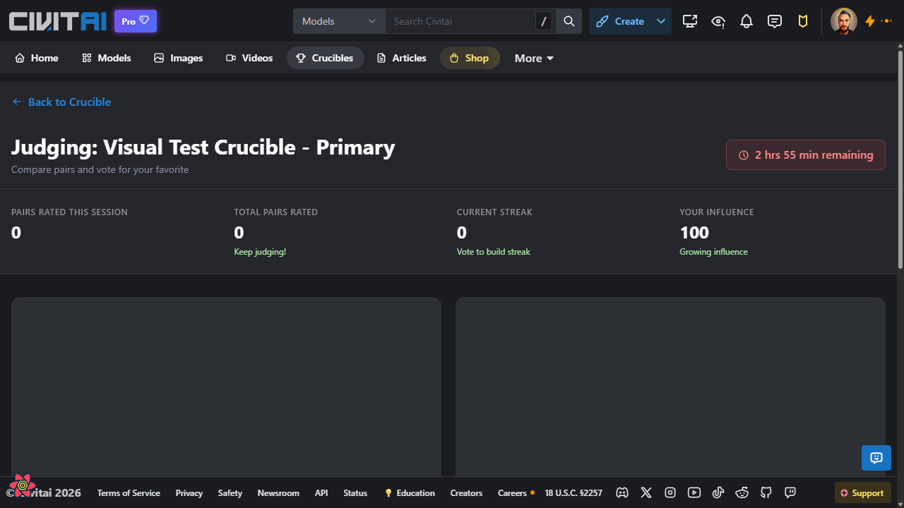
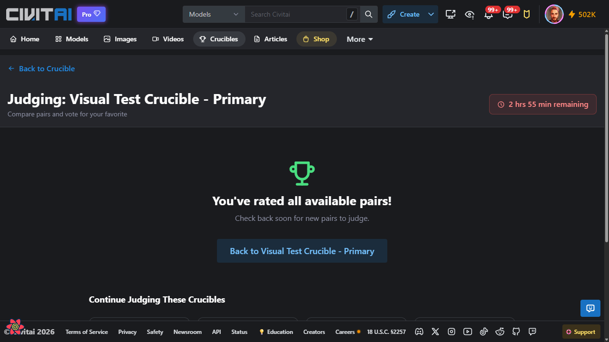
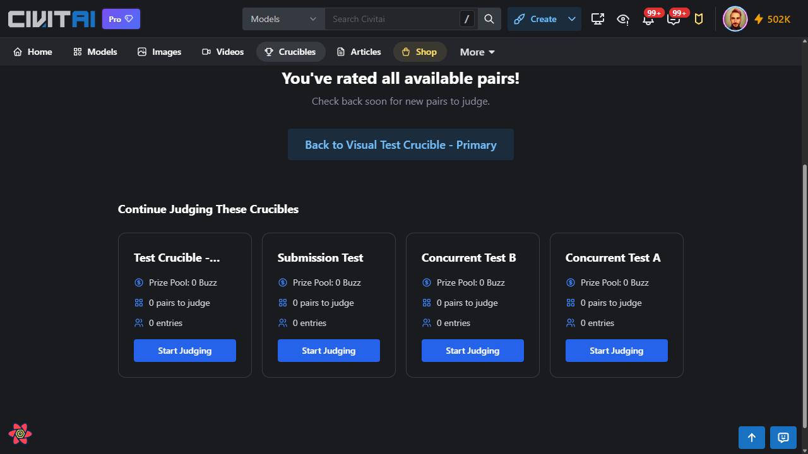
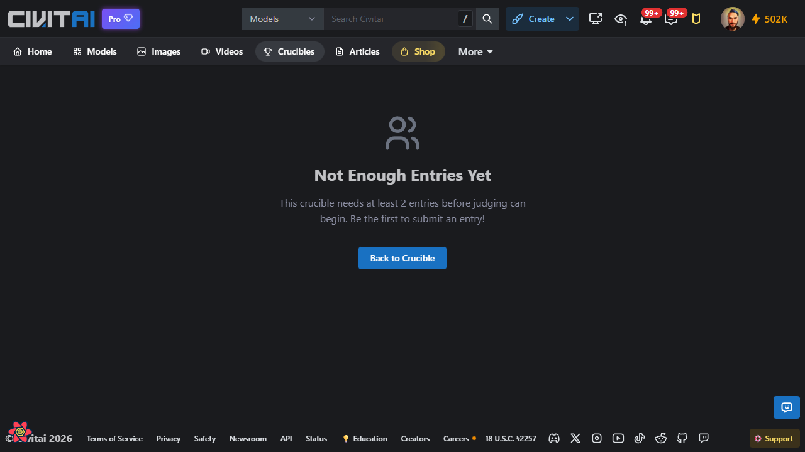
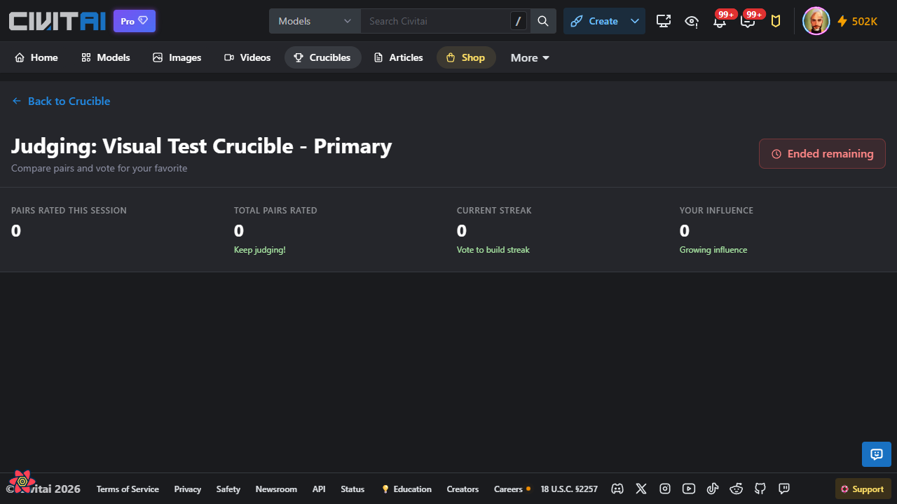

# Crucible Rating/Judging Flow

**Flow ID**: 04-rating-flow
**Created**: 2026-01-17
**Profile**: member
**Base URL**: http://localhost:3000

## Overview

This flow documents the crucible judging/rating experience, including the stats bar, comparison interface states, and suggested crucibles section. The judging page allows users to vote on head-to-head image comparisons to help determine winners.

## Screenshots

### 1. Judging Interface with Stats Bar


The initial judging page showing:
- **Back to Crucible** link (top left)
- **Page Title**: "Judging: [Crucible Name]"
- **Description**: "Compare pairs and vote for your favorite"
- **Time Remaining Badge**: Shows remaining time (e.g., "2 hrs 55 min remaining")
- **Stats Bar** with 4 metrics:
  - PAIRS RATED THIS SESSION: Current session count
  - TOTAL PAIRS RATED: Lifetime count with "Keep judging!" message
  - CURRENT STREAK: Consecutive votes with "Vote to build streak" message
  - YOUR INFLUENCE: Judge influence score with "Growing influence" message
- **Comparison Area**: Two side-by-side placeholders where image pairs would appear

### 2. All Pairs Rated State


When the user has rated all available pairs:
- **Trophy Icon**: Green trophy visual
- **Heading**: "You've rated all available pairs!"
- **Subtext**: "Check back soon for new pairs to judge."
- **Action Button**: "Back to [Crucible Name]"
- **Loading Indicator**: Spinner for suggested crucibles section

### 3. Suggested Crucibles Section


After rating all pairs, the page shows suggestions:
- **Section Title**: "Continue Judging These Crucibles"
- **Crucible Cards** showing:
  - Crucible name
  - Prize Pool amount (in Buzz)
  - Pairs to judge count
  - Entry count
  - "Start Judging" button

### 4. Not Enough Entries State


When a crucible doesn't have enough entries to start judging:
- **User Icon**: Profile/user icon visual
- **Heading**: "Not Enough Entries Yet"
- **Subtext**: "This crucible needs at least 2 entries before judging can begin. Be the first to submit an entry!"
- **Action Button**: "Back to Crucible"

### 5. Ended Crucible State


When trying to judge a crucible that has ended:
- **Time Badge**: Shows "Ended remaining"
- **Stats Bar** visible with all zeroes
- **Empty comparison area** (no pairs to judge)
- Stats show historical data (pairs rated, influence earned, etc.)

## Step-by-Step Reproduction

### Prerequisites
- Logged in as a member user
- An active crucible with entries exists

### Steps

1. **Navigate to judge page**
   ```
   Go to /crucibles/{id}/judge
   ```
   - Page loads with stats bar and comparison area

2. **View stats bar**
   - PAIRS RATED THIS SESSION: Resets each session
   - TOTAL PAIRS RATED: Cumulative count
   - CURRENT STREAK: Consecutive votes without skipping
   - YOUR INFLUENCE: Growing metric based on judging activity

3. **Judge image pairs** (when available)
   - Two images displayed side-by-side
   - Click preferred image to vote
   - Use keyboard shortcuts (if available)
   - Skip button available if unable to decide

4. **Complete all pairs**
   - When no more pairs available, "You've rated all available pairs!" message shows
   - Trophy icon displayed
   - "Back to Crucible" button to return

5. **Explore suggested crucibles**
   - Scroll down to see "Continue Judging These Crucibles"
   - Cards show prize pool, pairs to judge, and entry counts
   - "Start Judging" button on each card

## Key UI Elements

| Element | Description |
|---------|-------------|
| Stats Bar | 4-column metrics: Session pairs, Total pairs, Streak, Influence |
| Time Badge | Shows remaining time or "Ended" status |
| Comparison Area | Side-by-side image display for voting |
| Vote Buttons | Click on preferred image to cast vote |
| Skip Button | Skip current pair without voting |
| Back Link | Return to crucible landing page |
| Suggested Section | Other crucibles available for judging |

## Page States

| State | Condition | Display |
|-------|-----------|---------|
| Loading | Initial load | Placeholder boxes in comparison area |
| Active Judging | Pairs available | Side-by-side images with vote interface |
| All Rated | No more pairs | Trophy + "All pairs rated" message |
| Not Enough Entries | < 2 entries | User icon + "Not Enough Entries Yet" message |
| Ended | Crucible finished | "Ended" badge + empty comparison area |

## Notes

- Stats bar shows different metrics based on user's judging history
- YOUR INFLUENCE starts at 100 for active crucibles and 0 for ended ones
- The suggested crucibles section loads asynchronously
- Keyboard shortcuts may be available for faster judging (not visible in current test state)
- Vote buttons and skip button are only visible when pairs are available for comparison
- The side-by-side comparison interface could not be captured as no crucibles had active pairs available for judging in the test environment
